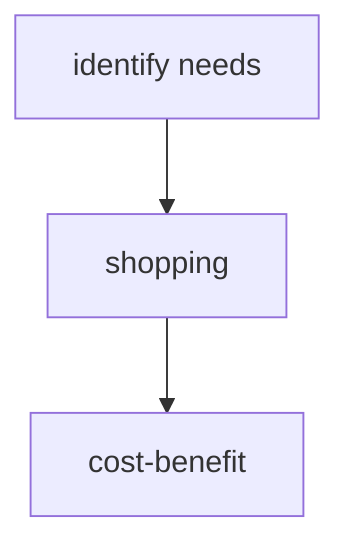
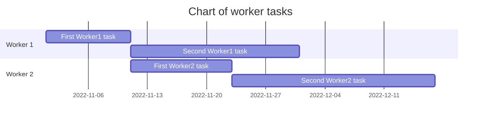
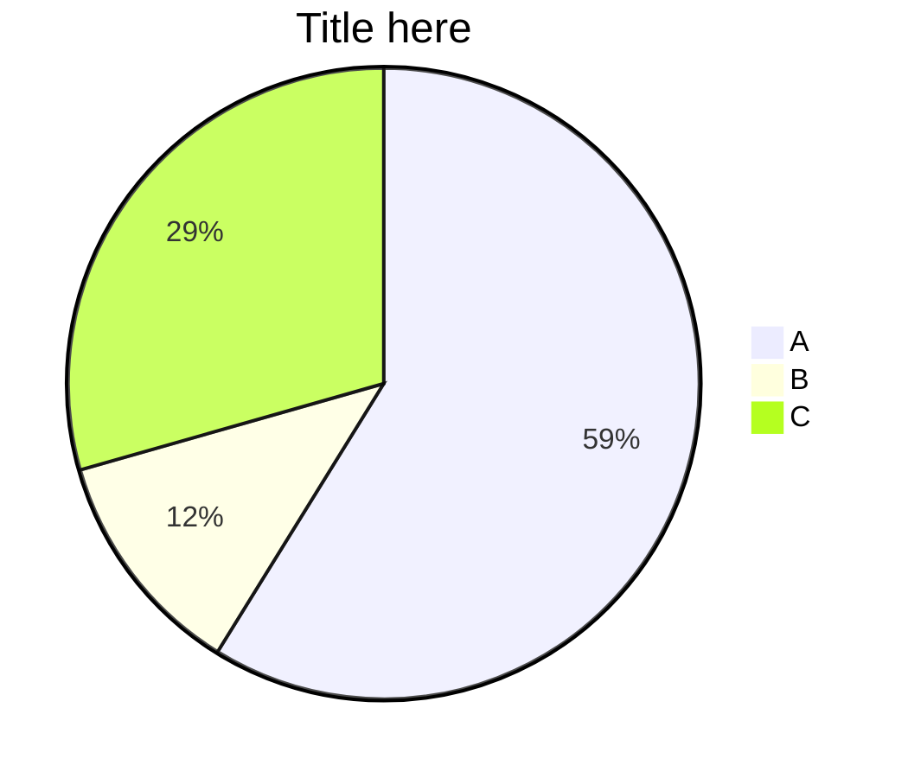
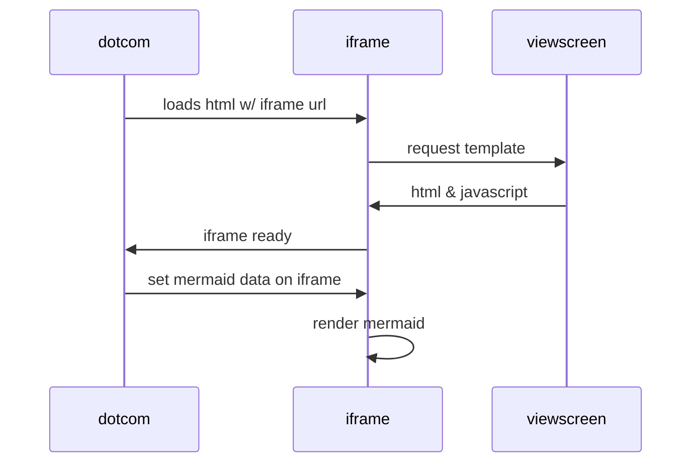
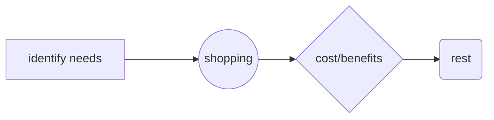
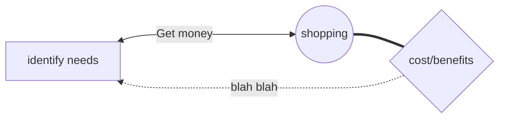
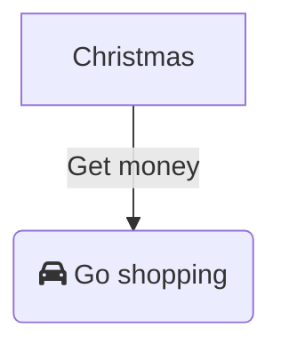

### [[YOUR MOC]]

# Mermaid

Mermaid is a JavaScript based diagramming and charting tool that renders Markdown-inspired text definitions to create and modify diagrams dynamically.

## Chart Setup

The first thing to tell mermaid is what type of chart you want to create.

The second thing is to declare which direction the chart should progress. You have a choice of TB (Top-Bottom), LR (Left-Right) or their opposites, BT and RL.

Then you can start adding the nodes you want and what sort of connection they have.

The most simple node consists of a single word. But if you want to have multiple words in one node, they need to be enclosed with square brackets and any alphanumeric string.

You also need to use an alphanumeric prefix and specific brackets if you want to change the shape of the node.

Lastly, you can show different and multiple relationships between the nodes. You can change the thickness of the links and whether there should be arrows. You can also add text to state the nature of the link.

## Chart types

### Flowchart

### Gantt

### Graph

### Pie chart

### Sequence Diagram

## Node types

## Relationship types

You can change the thickness of the links and whether there should be arrows. You can also add text to state the nature of the link.

## Adding icons

## Miscellaneous

## Links

* [Mermaid Homepage](https://mermaid.js.org/).
* 