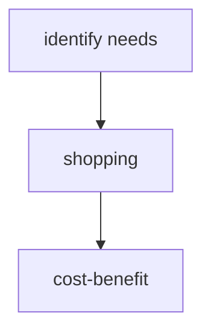
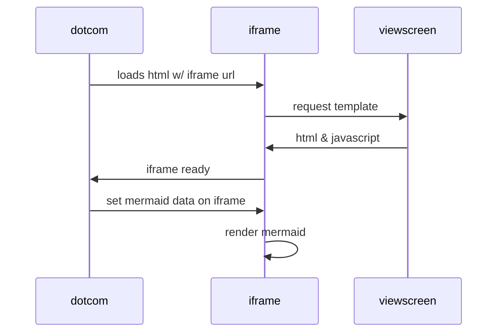

### [[YOUR MOC]]

# Mermaid

Mermaid is a JavaScript based diagramming and charting tool that renders Markdown-inspired text definitions to create and modify diagrams dynamically.

## Flowchart

## Graph

## Sequence Diagram

## Miscellaneous

## Links

* [Mermaid Homepage](https://mermaid.js.org/).
* 