### [[YOUR MOC]]

# Mermaid

Mermaid is a JavaScript based diagramming and charting tool that renders Markdown-inspired text definitions to create and modify diagrams dynamically.

## Chart Setup

The first thing to tell mermaid is what type of chart you want to create.

The second thing is to declare which direction the chart should progress. You have a choice of TB (Top-Bottom), LR (Left-Right) or their opposites, BT and RL.

Then you can start adding the nodes you want and what sort of connection they have.

The most simple node consists of a single word. But if you want to have multiple words in one node, they need to be enclosed with square brackets and any alphanumeric string.

You also need to use an alphanumeric prefix and specific brackets if you want to change the shape of the node.

Lastly, you can show different and multiple relationships between the nodes. You can change the thickness of the links and whether there should be arrows. You can also add text to state the nature of the link.

## Chart types

### Class

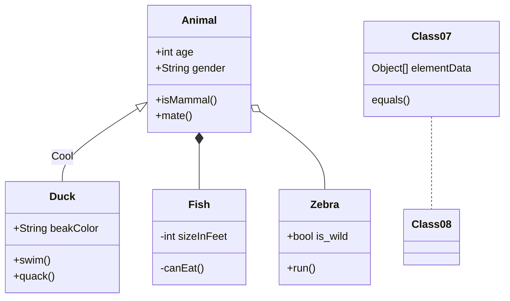

To describe the visibility (or encapsulation) of an attribute or method/function that is a part of a class (i.e. a class member), optional notation may be placed before that members' name:

-   `+` Public
-   `-` Private
-   `#` Protected
-   `~` Package/Internal

You can also include additional _classifiers_ to a method definition by adding the following notation to the _end_ of the method, i.e.: after the `()`:
-   `*` Abstract e.g.: `someAbstractMethod()*`
-   `$` Static e.g.: `someStaticMethod()$`

You can also include additional _classifiers_ to a field definition by adding the following notation to the end of its name:
-   `$` Static e.g.: `String someField$`

There are eight different types of relations defined for classes under UML which are currently supported:

| Type      | Description  |
| --------- | ------------ |
| \<\|\-\-      | Inheritance  |
| \*\-\-       | Composition  |
| o\-\-       | Aggregation  |
| \-\->       | Association  |
| \-\-        | Link (Solid) |
| ..>       | Dependency   |
| ..\|>      | Realization  |
| ..        | Link (Dashed)|

### Entity relationship

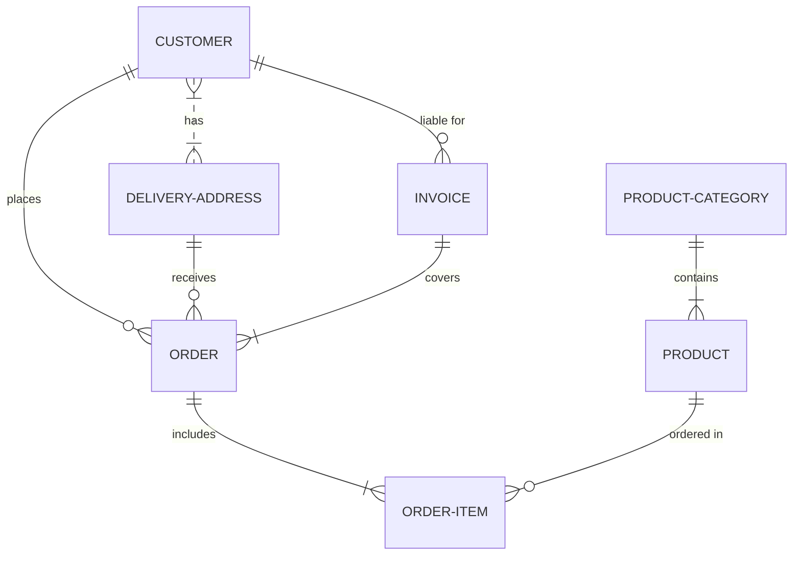


### Flowchart

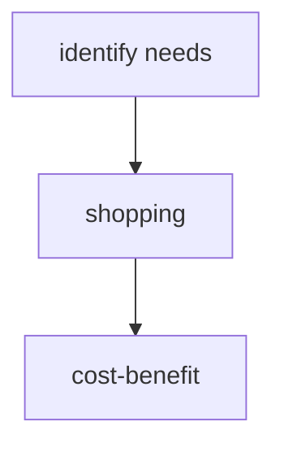

### Gantt

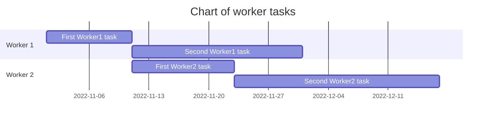

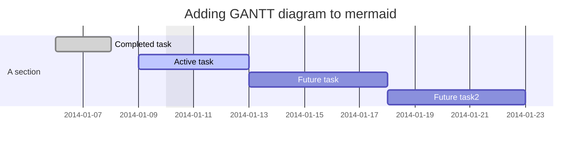

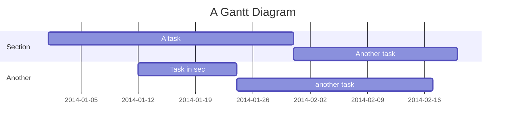
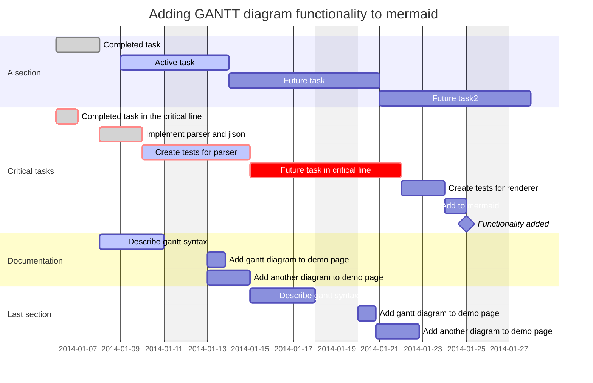

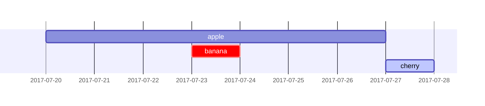

```mermaid
gantt
dateFormat HH:mm
axisFormat %H:%M
Initial milestone : milestone, m1, 17:49,2min
taska2 : 10min
taska3 : 5min
Final milestone : milestone, m2, 18:14, 2min
```

### Git

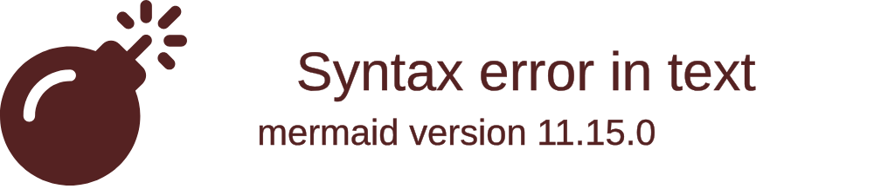

### Graph


### Journey

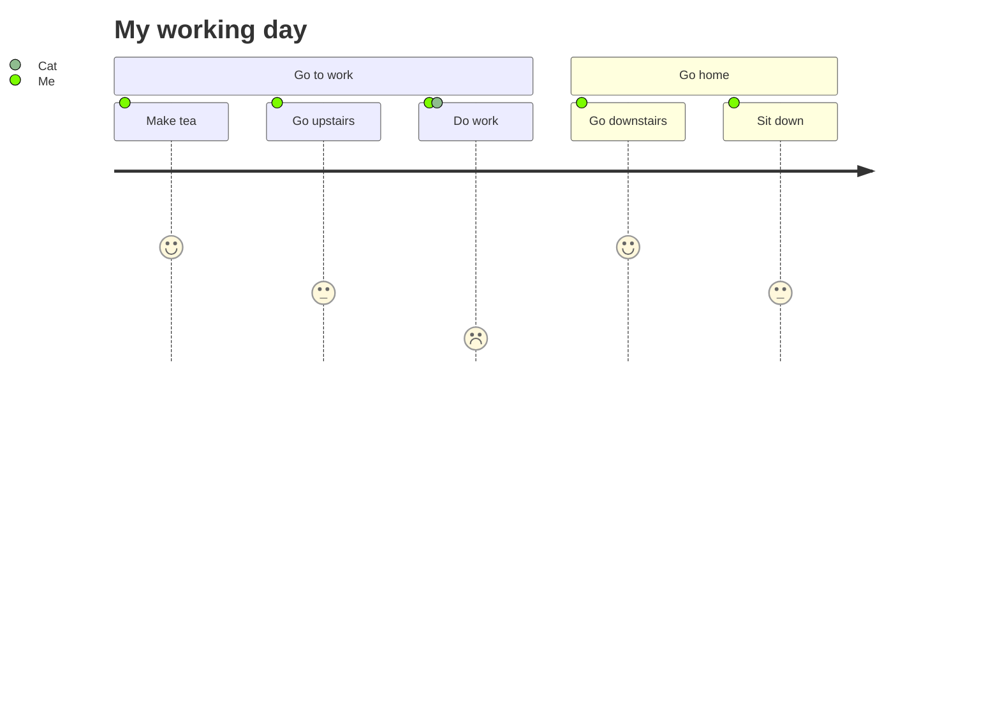

### Mindmap

```mermaid
mindmap

root((mindmap))

Origins

Long history

::icon(fa fa-book)

Popularisation

British popular psychology author Tony Buzan

Research

On effectivness<br/>and features

On Automatic creation

Uses

Creative techniques

Strategic planning

Argument mapping

Tools

Pen and paper

Mermaid
```

### Pie

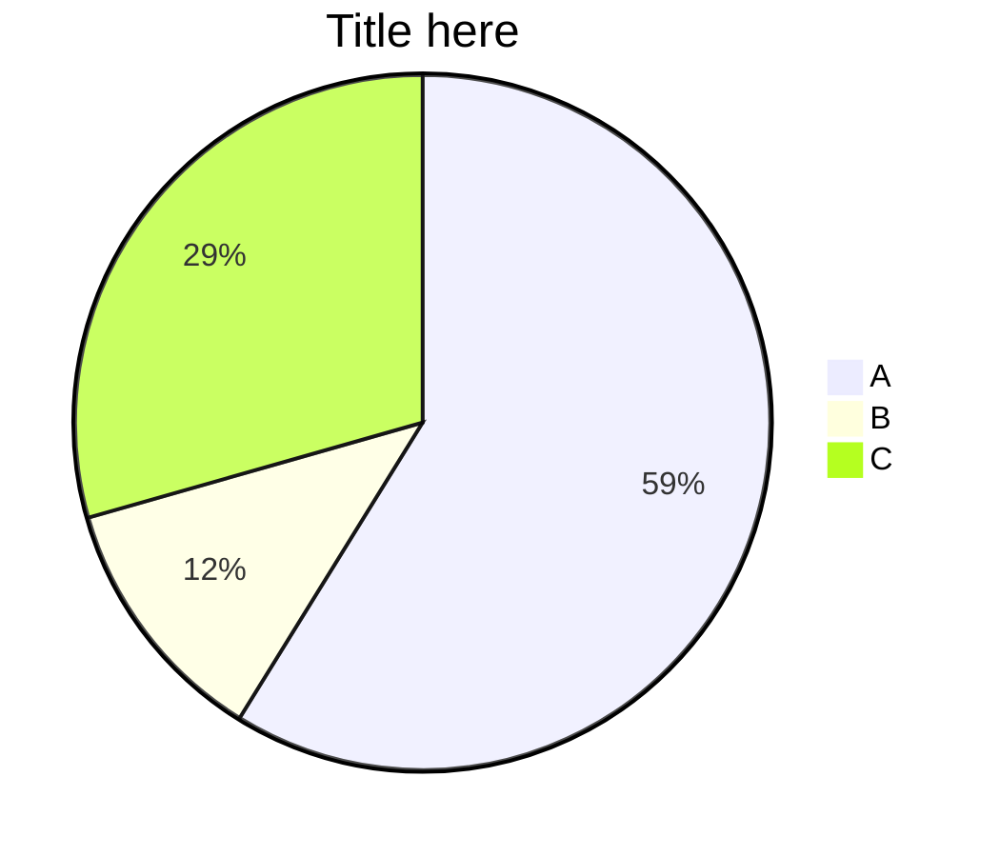

### Sequence

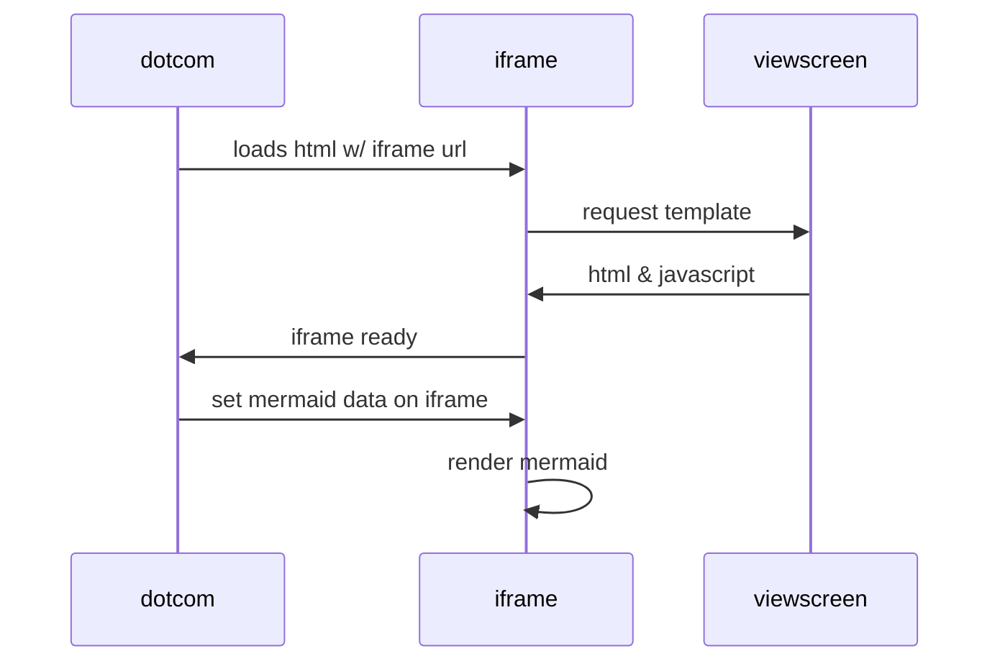

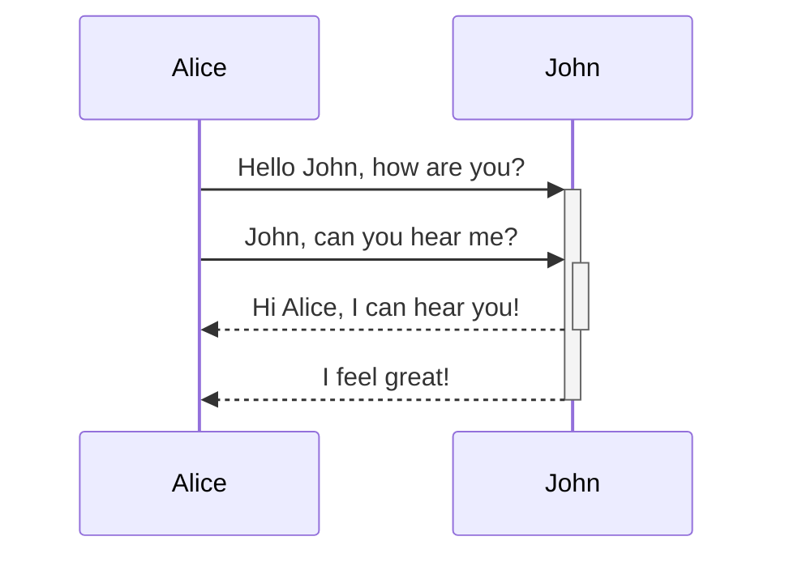
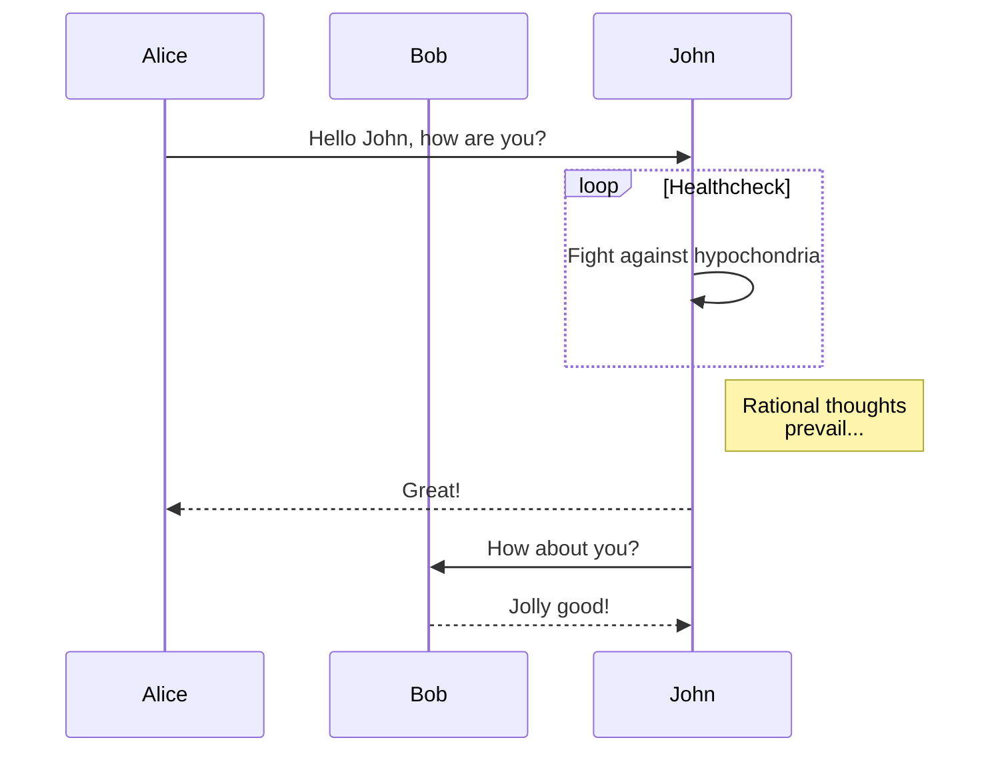

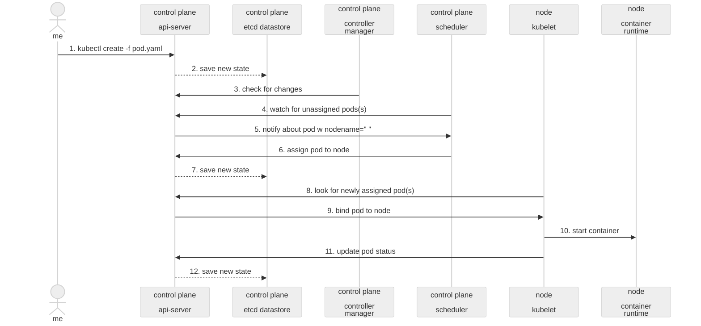

### State

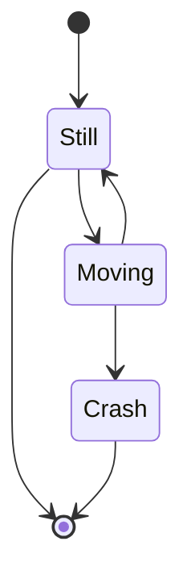

### Subgraph

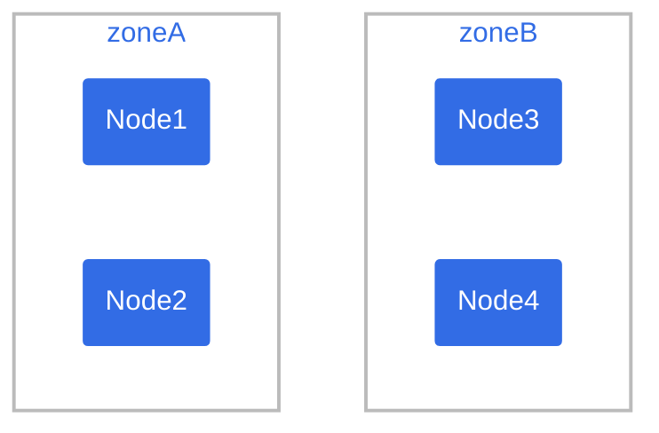
```mermaid
flowchart TB
    c1-->a2
    subgraph ide1 [one]
    a1-->a2
    end
```

```mermaid
flowchart TB
    c1-->a2
    subgraph one
    a1-->a2
    end
    subgraph two
    b1-->b2
    end
    subgraph three
    c1-->c2
    end
    one --> two
    three --> two
    two --> c2
```

```mermaid
flowchart LR
  subgraph TOP
    direction TB
    subgraph B1
        direction RL
        i1 -->f1
    end
    subgraph B2
        direction BT
        i2 -->f2
    end
  end
  A --> TOP --> B
  B1 --> B2
```

## Node types

```mermaid
flowchart LR
	A[identify needs] ---> B((shopping)) --> C{cost/benefits} --> D(rest)
```
```mermaid
flowchart LR
	id1([This is the text in the box]) --> id2[[This is the text in the box]] --> id3[(Database)]
```
```mermaid
flowchart LR
    id1>Text] --> id2{{Text}} --> id3[/Text/] --> id4[\Text\]
```

```mermaid
flowchart LR
	id5[/Text\] --> id6[\Text/] --> id7(((Text)))
```

## Relationship types

You can change the thickness of the links and whether there should be arrows. You can also add text to state the nature of the link.

```mermaid
flowchart LR
A[identify needs] <---> |Get money| B((shopping)) === C{cost/benefits}
C{cost/benefits} -.blah blah.-> A[identify needs]
```

```mermaid
graph LR;
	A--> B & C & D;
	B--> A & E;
	C--> A & E;
	D--> A & E;
	E--> B & C & D;
```

```mermaid
flowchart LR
    A ~~~ B  # Invisible link.
```

```mermaid
flowchart LR
   a --> b & c--> d
```

```mermaid
flowchart TB
    A & B--> C & D
```

Each node in the flowchart is ultimately assigned to a rank in the rendered graph, i.e. to a vertical or horizontal level (depending on the flowchart orientation), based on the nodes to which it is linked. By default, links can span any number of ranks, but you can ask for any link to be longer than the others by adding extra dashes in the link definition.

## Adding icons

```mermaid
flowchart TD

A[Christmas] -->|Get money| B(fa:fa-car Go shopping)
```

## How to style diagrams

You can style one or more diagram elements using well-known CSS nomenclature. You accomplish this using two types of statements in the Mermaid code:

* `classDef` defines a class of style attributes.
* `class` defines one or more elements to apply the class to.

```
classDef k8s fill:#326ce5,stroke:#fff,stroke-width:4px,color:#fff; // defines style for the k8s class
class ingress,service,pod1,pod2 k8s; // k8s class is applied to elements ingress, service, pod1 and pod2.
```

## Comments

Comments can be entered within a flow diagram, which will be ignored by the parser. Comments need to be on their own line, and must be prefaced with `%%` (double percent signs). Any text after the start of the comment to the next newline will be treated as a comment, including any flow syntax.

```mermaid
flowchart LR
%% this is a comment A -- text --> B{node}
   A -- text --> B -- text2 --> C

```

## Miscellaneous

## Links

* [Mermaid homepage](https://mermaid.js.org/).
* [Mermaid live editor](https://mermaid.live/).
* [mermaid-cli](https://github.com/mermaid-js/mermaid-cli): Takes a mermaid definition file as input and generates an svg/png/pdf file as output.
* [Mermaid Ink](https://mermaid.ink/): Convert mermaid live output to image via the web.
* 
