### [[YOUR MOC]]

# Mermaid

Mermaid is a JavaScript based diagramming and charting tool that renders Markdown-inspired text definitions to create and modify diagrams dynamically.

## Chart Setup

The first thing to tell mermaid is what type of chart you want to create.

The second thing is to declare which direction the chart should progress. You have a choice of TB (Top-Bottom), LR (Left-Right) or their opposites, BT and RL.

Then you can start adding the nodes you want and what sort of connection they have.

The most simple node consists of a single word. But if you want to have multiple words in one node, they need to be enclosed with square brackets and any alphanumeric string.

You also need to use an alphanumeric prefix and specific brackets if you want to change the shape of the node.

Lastly, you can show different and multiple relationships between the nodes. You can change the thickness of the links and whether there should be arrows. You can also add text to state the nature of the link.

## Chart types

### Class

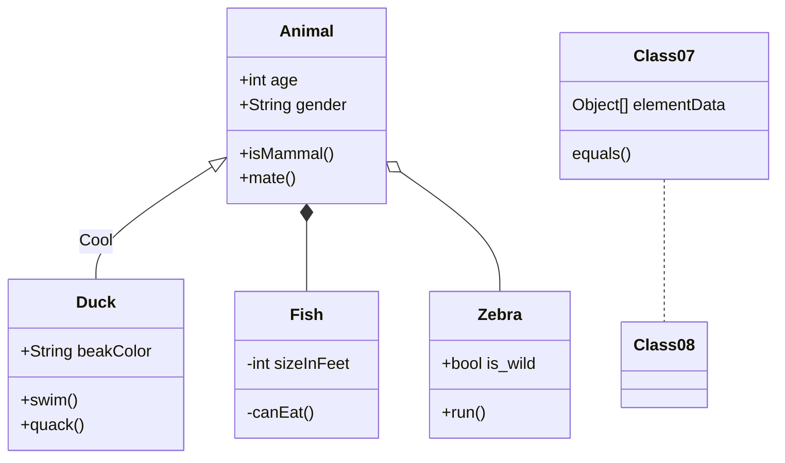

### Entity relationship

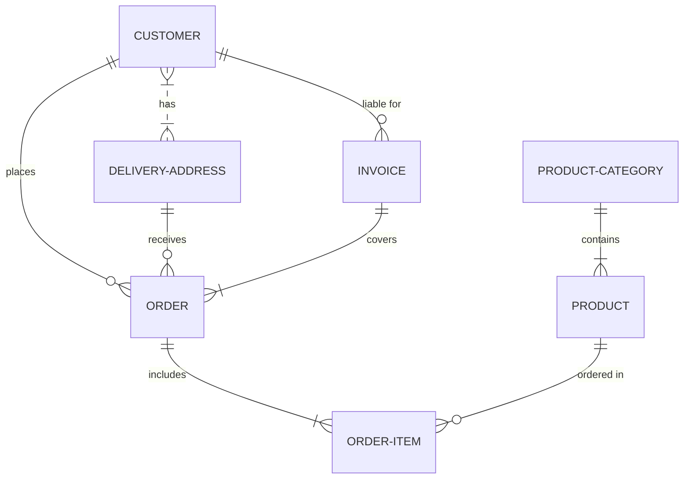


### Flowchart

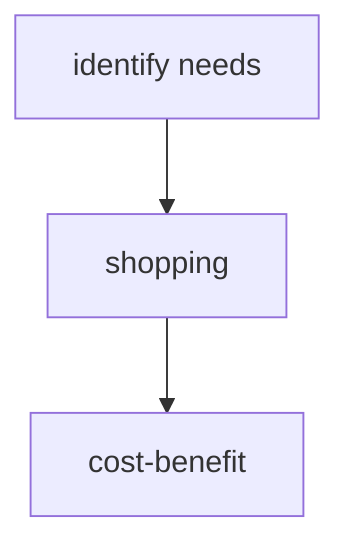

### Gantt

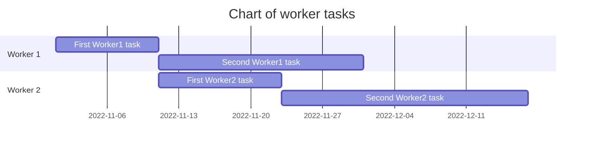

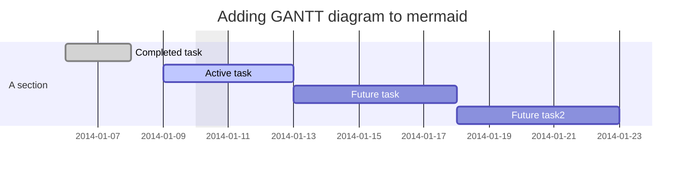

### Git

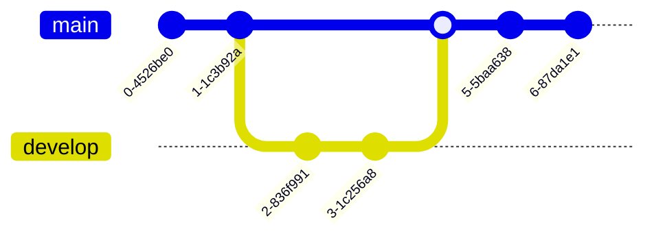

### Graph


### Journey

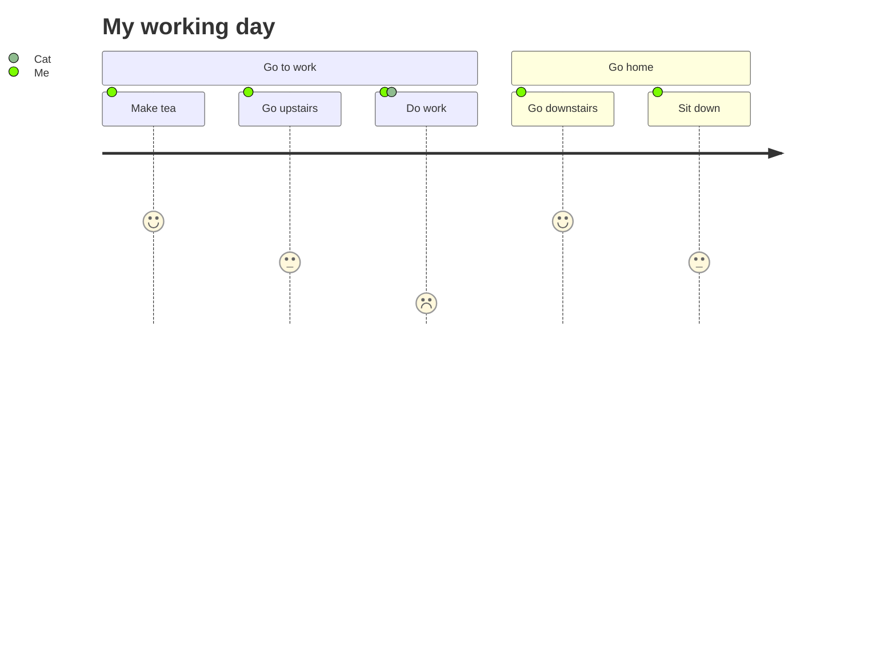

### Mindmap

```mermaid
mindmap

root((mindmap))

Origins

Long history

::icon(fa fa-book)

Popularisation

British popular psychology author Tony Buzan

Research

On effectivness<br/>and features

On Automatic creation

Uses

Creative techniques

Strategic planning

Argument mapping

Tools

Pen and paper

Mermaid
```

### Pie

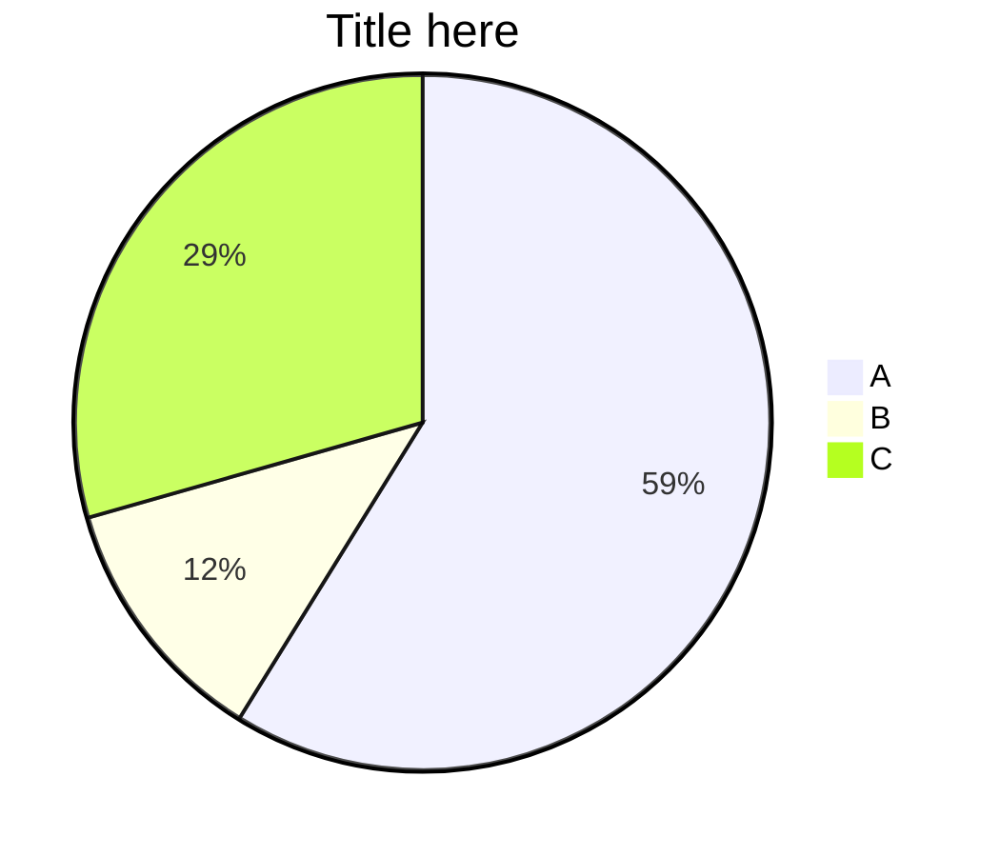

### Sequence

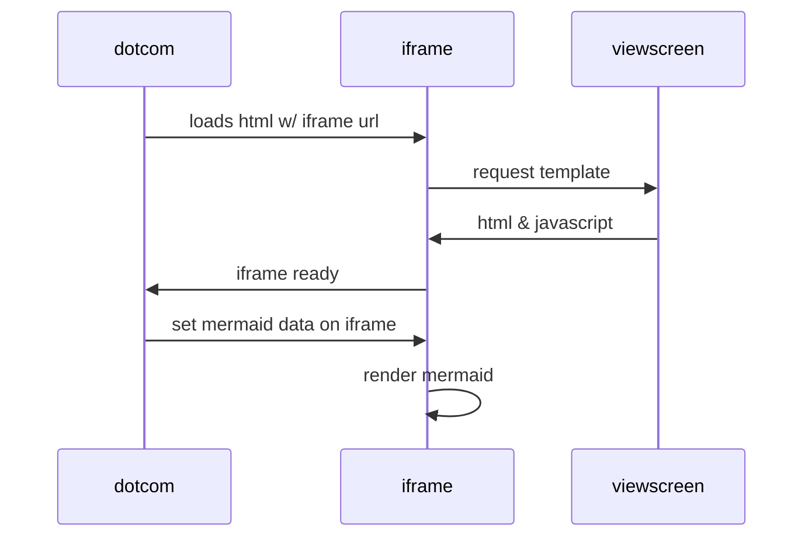

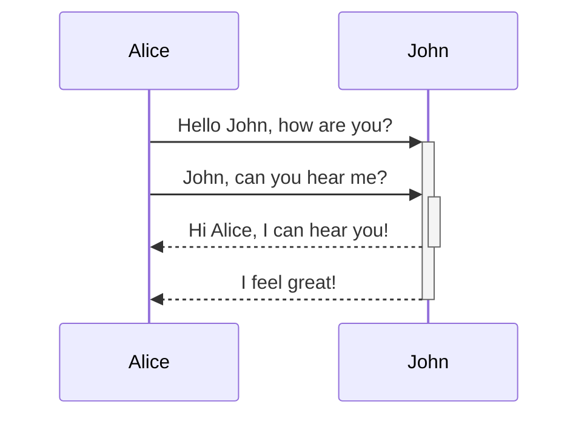
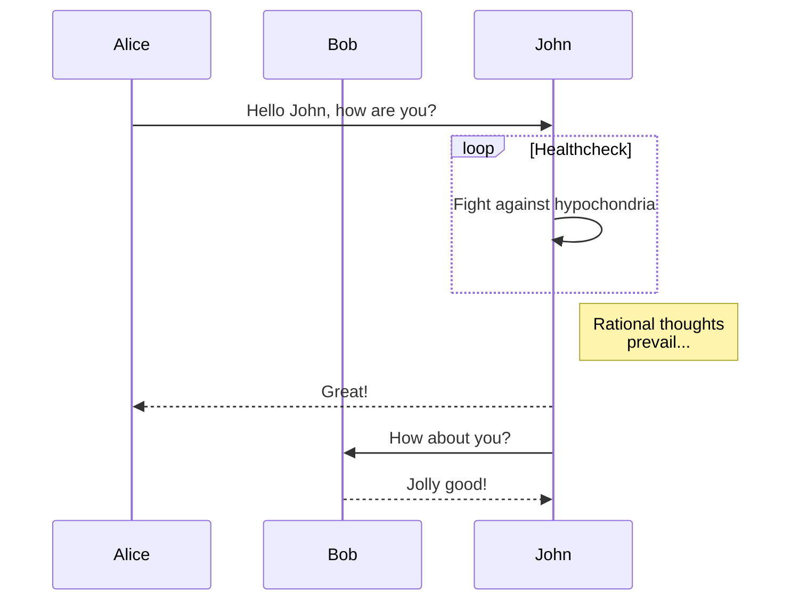

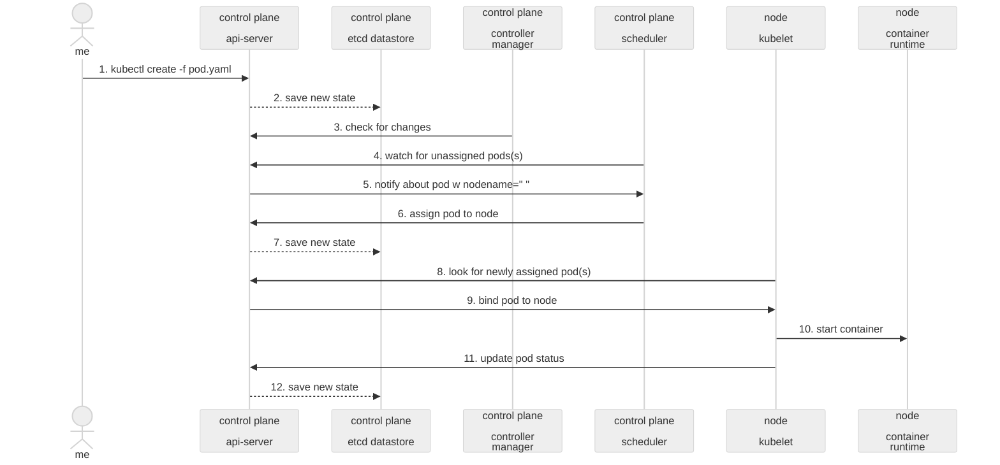

### State

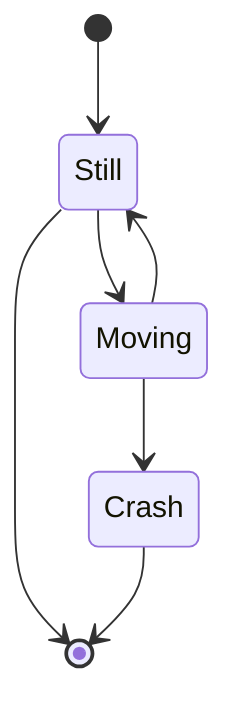

### Subgraph

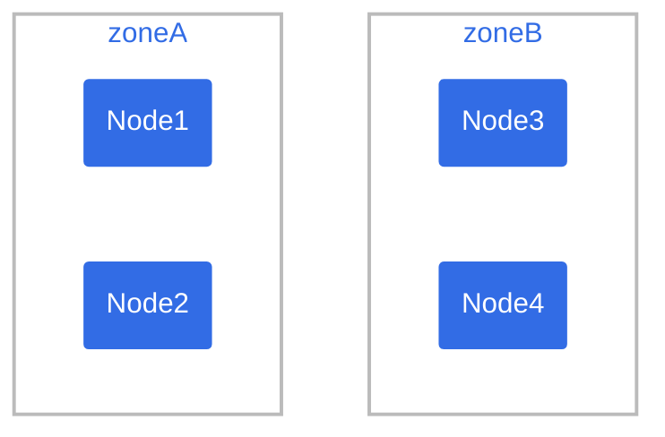
## Node types

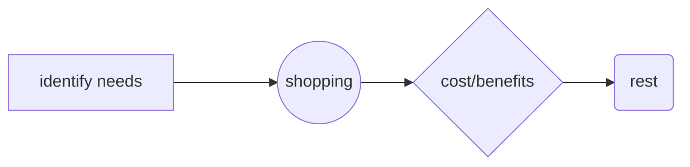
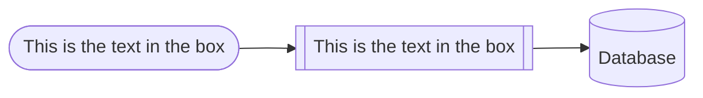
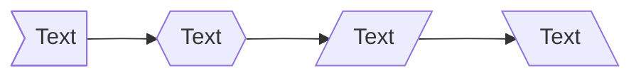

## Relationship types

You can change the thickness of the links and whether there should be arrows. You can also add text to state the nature of the link.

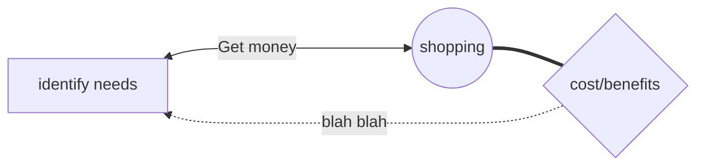

```mermaid
graph LR;
	A--> B & C & D;
	B--> A & E;
	C--> A & E;
	D--> A & E;
	E--> B & C & D;
```

## Adding icons

```mermaid
flowchart TD

A[Christmas] -->|Get money| B(fa:fa-car Go shopping)
```

## How to style diagrams

You can style one or more diagram elements using well-known CSS nomenclature. You accomplish this using two types of statements in the Mermaid code:

* `classDef` defines a class of style attributes.
* `class` defines one or more elements to apply the class to.

```
classDef k8s fill:#326ce5,stroke:#fff,stroke-width:4px,color:#fff; // defines style for the k8s class
class ingress,service,pod1,pod2 k8s; // k8s class is applied to elements ingress, service, pod1 and pod2.
```

## Miscellaneous

## Links

* [Mermaid homepage](https://mermaid.js.org/).
* [Mermaid live editor](https://mermaid.live/).
* [mermaid-cli](https://github.com/mermaid-js/mermaid-cli): Takes a mermaid definition file as input and generates an svg/png/pdf file as output.
* [Mermaid Ink](https://mermaid.ink/): Convert mermaid live output to image via the web.
* 
